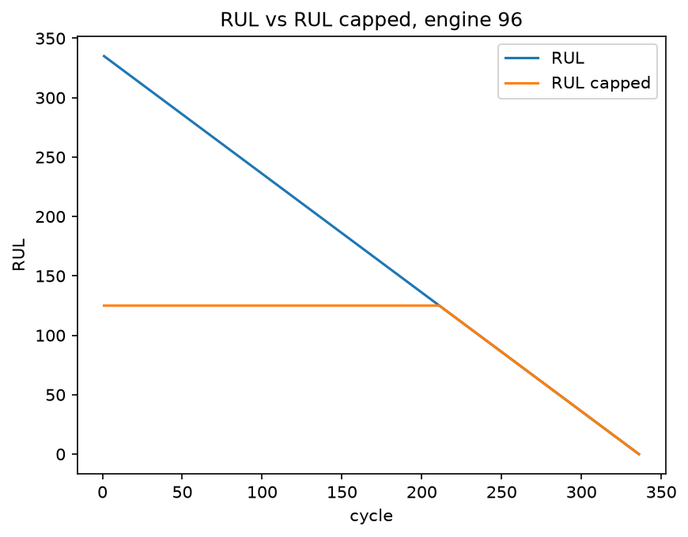
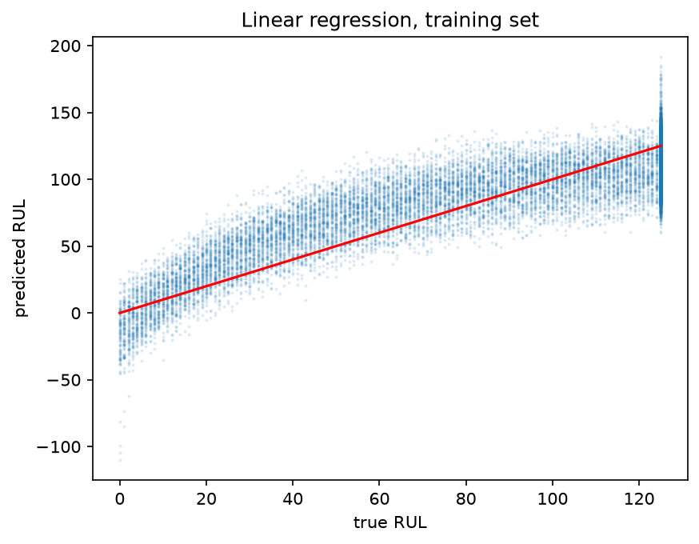

# Remaining Useful Life Prediction on NASA C-MAPSS Turbofan Engines

Predicting how many operating cycles a turbofan engine has left, using sensor
data from NASA's C-MAPSS simulation dataset. Best model: linear regression on
45 rolling-window features, test RMSE 20.19.

## Background

The components of a turbofan engine degrade gradually. Fixing a component only
after it has failed is both dangerous and costly: in the aerospace industry, an
unscheduled failure often means an in-flight shutdown or an emergency diversion,
and in the worst case it affects the safety of the passengers on board.
Maintaining engines at fixed intervals reduces this safety risk, but it is not
cost effective, because engines that are still in good condition are removed and
replaced. Neither solution is ideal. If we can predict the remaining useful life
(RUL) of each engine, we can then schedule maintenance individually, which allows
each engine to deliver its full value.

## Dataset

This project uses **FD001**, the simplest of the four subsets in NASA's C-MAPSS
turbofan engine degradation dataset. The data is simulated, generated by a
physics-based engine model rather than recorded from real flights.

- **Operating conditions:** single condition, single fault mode
- **Training set:** 100 engines, 20,631 cycles in total — each engine runs from
  a healthy state to failure
- **Test set:** 100 engines, with each trajectory truncated at an arbitrary point
  before failure; the true RUL at that point is given in `RUL_FD001.txt`
- **Per cycle:** 3 operational settings and 21 sensor measurements

The raw data is not included in this repository. Download it from the
[NASA Prognostics Data Repository](https://www.nasa.gov/intelligent-systems-division/discovery-and-systems-health/pcoe/pcoe-data-set-repository)
and extract the files into `data/CMaps/`.

## Method

**Label construction.** RUL is defined as the total lifespan of an engine minus
its current cycle — possible because every engine in the training set runs to
failure. Labels are capped at 125 cycles: during early operation the sensor
readings are almost identical from one cycle to the next, while the raw labels
differ by hundreds of cycles, so an uncapped target would force the model to fit
a distinction that does not exist in the data. Capping encodes a piecewise-linear
degradation assumption — flat while the engine is healthy, declining once
degradation begins.

*RUL before and after capping, engine 96. The capped label is flat while the
engine is healthy and declines linearly once degradation dominates.*

**Feature selection.** Of the 21 sensors, 6 remain constant throughout and are
dropped, leaving 15.

**Rolling window features.** For each of the 15 sensors, a 20-cycle rolling mean
and rolling standard deviation are computed, giving 45 features in total. A
single-cycle reading is noisy; the rolling mean smooths that noise and exposes
the underlying trend, while the rolling standard deviation captures changes in
variability. Together they encode information from the time dimension into each
row, which a model looking only at the current cycle would otherwise miss. This
change alone improved test RMSE from 21.89 to 20.19.

**Modelling.** Linear regression is used as a baseline, first on the 15 raw
sensors and then on the 45 rolling-window features. A random forest is trained on
the same 45 features for comparison, with and without a depth limit. Finally, the
feature set is pruned to the 27 features with importance above 0.001 and the
random forest retrained.

**Avoiding data leakage.** The `cycle` column is excluded from the feature set:
because RUL is derived from it, including it would leak the label directly. The
StandardScaler is fitted on training data only, never on the full dataset, so
that no information from the test set influences the transformation.

## Results

| Model | Features | Train RMSE | Test RMSE | Gap |
|---|---|---|---|---|
| Linear Regression | 15 | 21.47 | 21.89 | 0.42 |
| Linear Regression | 45 | 20.27 | **20.19** | −0.08 |
| Random Forest (no depth limit) | 45 | 3.10 | 22.00 | 18.90 |
| Random Forest (max_depth=8) | 45 | 14.78 | 21.62 | 6.84 |
| Random Forest (max_depth=8) | 27 | 14.82 | 21.76 | 6.94 |

RMSE is computed on the final cycle of each of the 100 test engines, against the
ground-truth RUL provided in `RUL_FD001.txt`. Training labels are capped at 125
cycles (piecewise-linear degradation assumption).

The best-performing model is the 45-feature linear regression (test RMSE 20.19).
Its train–test gap is close to zero (−0.08), which indicates that the model
generalises well. This means 20.19 reflects the model's real predictive ability
rather than luck or overfitting.

*Linear regression predictions on the training set. Two artefacts are visible:
predictions below zero, which are physically impossible, and a vertical band at
RUL = 125 where capping collapses many distinct engine states onto a single label.*

The unlimited-depth random forest is deliberately kept in the table as an example
of overfitting. With a training RMSE of 3.10 but a test RMSE of 22.00, this run
shows why judging a model on its training score alone is misleading — it is like
memorising the answers instead of learning.

Pruning the feature set from 45 to 27 removes 18 features, yet test RMSE rises
only from 21.62 to 21.76 — a 0.6% loss in accuracy. The train–test gap stays
essentially unchanged (6.84 to 6.94), so the degree of overfitting is unaffected
as well. This suggests that most of the predictive power is concentrated in a
small number of rolling-mean features, and that comparable performance can be
achieved with far fewer inputs. In a real engine health monitoring system, fewer
features means fewer sensors to install and maintain, and a lighter onboard
computational load — making this a worthwhile trade-off where sensor cost or
embedded compute is constrained.

## Key Findings

**Linear regression is unconstrained.** The model produces negative RUL
predictions, which are physically meaningless — nothing in the formulation
prevents it. Tree-based models cannot do this, since every prediction is an
average of observed training values. Clipping predictions at zero would be a
trivial post-processing fix.

**Rolling-mean features dominate.** Nine of the top ten features by random forest
importance are rolling means; only one raw sensor reading makes the list. This is
independent evidence for the same conclusion the experiment table shows — the
improvement from 21.89 to 20.19 came from encoding the time dimension, not from
chance.

**Six sensors carry no information.** Six of the 21 sensors remain constant across
every engine and every cycle. A constant input cannot distinguish between samples,
so they are dropped before modelling.

**Importance scores must be read with care.** `sensor_3_rmean` alone accounts for
63% of total importance, but this does not mean it carries 63% of the information.
Tree-based importance is winner-take-all: when two features are highly correlated
(a raw sensor and its own rolling mean, for example), whichever is selected first
at a split absorbs the credit, and the other appears useless. Low importance
therefore means "redundant given the others", not "uninformative".

**Regularisation has a recognisable signature.** Adding `min_samples_leaf=20` to
the depth-limited forest moved train RMSE from 14.51 to 14.78 and test RMSE from
21.74 to 21.62 — worse on training data, better on unseen data. That direction is
the defining behaviour of a regularisation constraint.

## Limitations & Next Steps

**Simulated data.** C-MAPSS is generated by a physics-based simulation, not
recorded from real engines. Real fleet data carries missing values, sensor drift
and maintenance events that are absent here.

**Single operating condition.** FD001 contains one operating condition and one
fault mode. FD002 and FD004 include six operating conditions, where raw sensor
readings shift with the flight regime rather than with degradation — that
confound would need to be handled before any of these results transfer.

**No sequence model.** Rolling windows are a hand-designed way of injecting
temporal information into a per-row model. An LSTM or 1D CNN would learn temporal
structure directly from the raw sequence, and is the natural next step.

**Rolling standard deviations contribute little.** All `_rstd` features rank in
the lower half of the importance list, suggesting that on FD001 degradation shows
up mainly as a shift in mean rather than an increase in variability. This may well
reverse on the multi-condition subsets.

## Repository Structure

├── data/CMaps/ # raw dataset (not tracked — see Dataset)
├── figures/ # plots used in this README
├── notebooks/
│ ├── 01_data_exploration_archive.ipynb # exploratory work, kept for reference
│ └── 02_modeling.ipynb # clean end-to-end pipeline
└── README.md

**Reproducing the results.** Download FD001 into `data/CMaps/`, then run
`02_modeling.ipynb` with Restart & Run All. Requires `pandas`, `numpy`,
`matplotlib` and `scikit-learn`.